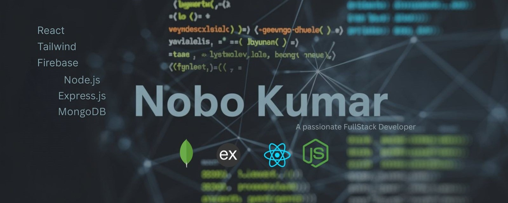

<div align="center">
  
</div>

 
<p align="left">  </p>
<a href="https://wakatime.com/@63dbaf22-bd11-4441-a69f-d3d8bb546e94"></a>

### 👋 About Me

Iam **Nobo Kumar**, a dedicated **Full Stack Web Developer** focused on building responsive and high-performance web applications using the **MERN stack** (**MongoDB**, **Express.js**, **React.js**, **Node.js**). I am passionate about writing clean, efficient code and transforming ideas into scalable digital experiences.

🌟 **Current Focus**  
- 🚀 Advancing my full stack development skills by building real-world projects.  
- 📘 Exploring advanced concepts in **JavaScript**, **React**, **Node.js**, and scalable backend architecture.

🤝 **Collaboration**  
- Always open to collaborating on **web development projects** and contributing to **open-source initiatives**.  
- 📬 Reach me at **nobokumar227@gmail.com** for collaboration, ideas, or dev discussions.


<h3 align="left">📞Connect with me:</h3>
<p align="left">
<a href="https://www.linkedin.com/in/nobo-kumar/" target="blank"></a>
 <a href="https://x.com/noboKumar227" target="blank"></a>
<a href="https://www.facebook.com/crazy.nobo/" target="blank"></a>
<a href="https://discord.gg/nobo#7101" target="blank"></a>
<a href="mailto:nobokumar227@gmail.com" target="blank"></a>
</p>

<h3 align="left">🛠️ Skills & Technologies:</h3>
<p align="left">

<!-- Frontend -->
<strong>Frontend:</strong> <br/>
<a href="https://www.w3.org/html/" target="_blank" rel="noreferrer">
  
</a>
<a href="https://developer.mozilla.org/en-US/docs/Web/CSS" target="_blank" rel="noreferrer">
  
</a>
<a href="https://developer.mozilla.org/en-US/docs/Web/JavaScript" target="_blank" rel="noreferrer">
  
</a>
<a href="https://www.typescriptlang.org/" target="_blank" rel="noreferrer">
  
</a>
</br>
<a href="https://tailwindcss.com/" target="_blank" rel="noreferrer">
  
</a>
<a href="https://react.dev/" target="_blank" rel="noreferrer">
  
</a>
<a href="https://nextjs.org/" target="_blank" rel="noreferrer">
  
</a>
<a href="https://reactrouter.com/" target="_blank" rel="noreferrer">
  
</a>
</br>
<a href="https://tanstack.com/query/latest" target="_blank" rel="noreferrer">
  
</a>
<a href="https://react-hook-form.com/" target="_blank" rel="noreferrer">
  
</a>
<br/>

<!-- Backend & Database -->
<strong>Backend & Database:</strong> <br/>
<a href="https://nodejs.org/" target="_blank" rel="noreferrer">
  
</a>
<a href="https://expressjs.com/" target="_blank" rel="noreferrer">
  
</a>
<a href="https://firebase.google.com/" target="_blank" rel="noreferrer">
  
</a>
<a href="https://axios-http.com/" target="_blank" rel="noreferrer">
  
</a>


<a href="https://www.mongodb.com/" target="_blank" rel="noreferrer">
  
</a>
<a href="https://www.postgresql.org/" target="_blank" rel="noreferrer">
  
</a>

<br/>

<!-- Tools -->
<strong>Tools:</strong> <br/>
<a href="https://git-scm.com/" target="_blank" rel="noreferrer">
  
</a>
<a href="https://vitejs.dev/" target="_blank" rel="noreferrer">
  
</a>
<a href="https://code.visualstudio.com/" target="_blank" rel="noreferrer">
  
</a>
<a href="https://www.postman.com/" target="_blank" rel="noreferrer">
  
</a>
</br>
<a href="https://vercel.com/" target="_blank" rel="noreferrer">
  
</a>
<a href="https://www.figma.com/" target="_blank" rel="noreferrer">
  
</a>
<a href="https://www.microsoft.com/windows" target="_blank" rel="noreferrer">
  
</a>
<a href="https://ubuntu.com/" target="_blank" rel="noreferrer">
  
</a>

</p>

<table>
  <tr>
    <td>
      
    </td>
    <td>
      <a href="https://git.io/streak-stats">
        
      </a>
    </td>
  </tr>
</table>


<!--START_SECTION:waka-->

```txt
From: 02 February 2026 - To: 09 February 2026

Total Time: 0 secs

No activity tracked
```

<!--END_SECTION:waka-->
